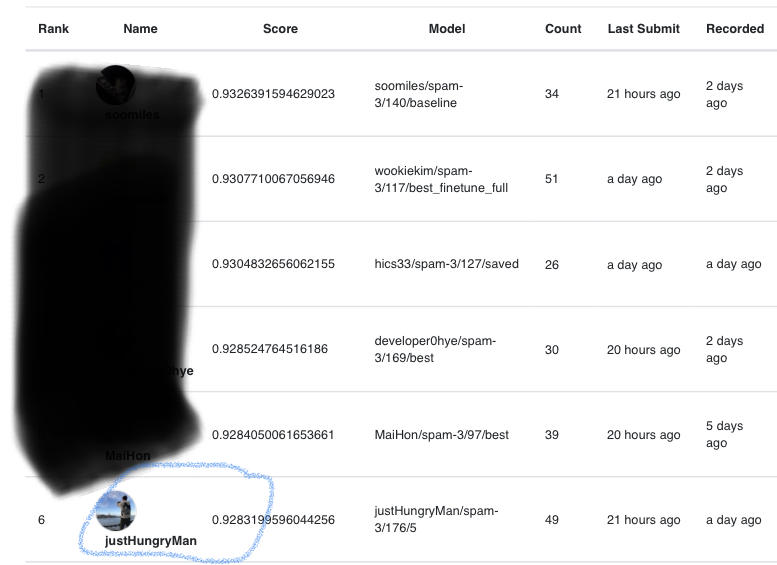
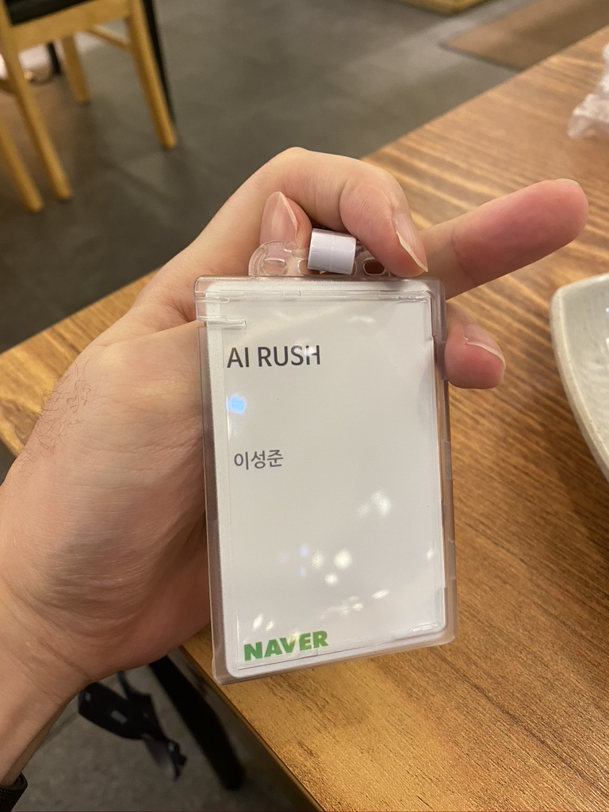
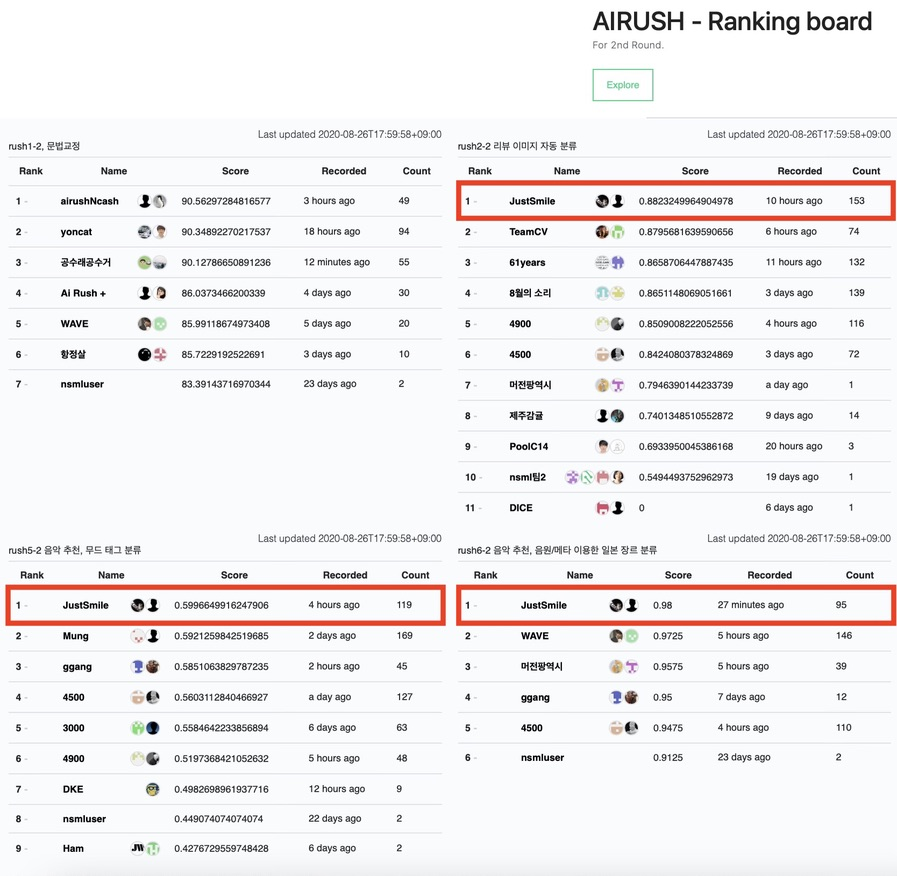
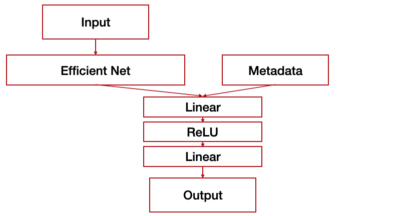
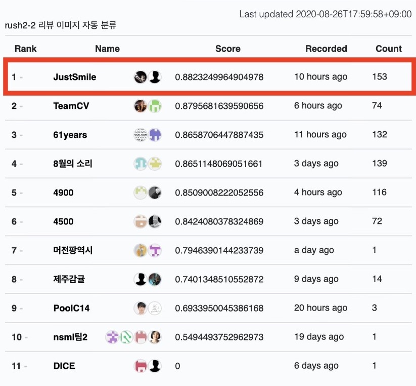
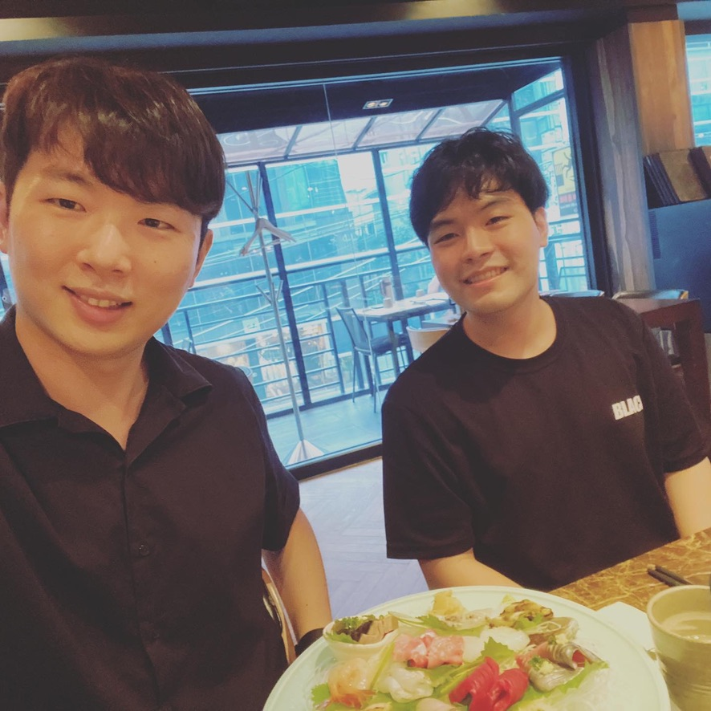

# Naver AI RUSH 2020

AI RUSH 는 네이버 AI 실무 전문가와 함께 프로젝트에 참여하는 [AI모델링 챌린지](https://campaign.naver.com/airush/)이며 서류 심사와 코딩테스트를 통해 100명의 참가자에 선별되면 AI 과제에 참여할 수 있어요. 7월 13일부터 7월 31일까지 Round 1을 통해 50명의 Round 2 진출자를 선발하고 8월 3일부터 8월 27일까지 Round 2를 진행했습니다. Round 1 과제는 NLP 와 Vision 과제가 나왔으며 각 과제별 상위 25명이 Round 2에 진출해요. 저는 Vision 과제에 참여하였고 6등의 성적으로 Round 2에 진출하였죠.

 
Round 2 과제는 문법 교정, Vision, 시계열, 음악추천 등 여러 주제가 주어졌는데 그 중 Vision과 2개의 음악추천 과제에 참여했어요. 이때 운이 좋게 Round 1 Vision 과제 1등의 성적을 가졌던 [soomiles](https://github.com/soomiles) 님과 팀원이 되었고 나와 아이디를 합쳐 **JustSmile** 이라는 팀명으로 참가했어요.

 
최종적으로 모든 과제에서 1등을 수상하였고 그 중 제가 중심적으로 맡았던 Vision 과제에 대한 후기를 작성할게요.

# Vision : 리뷰 이미지의 자동 분류
리뷰 이미지의 자동 분류는 네이버 쇼핑몰에 올라온 후기 이미지에 대한 분류를 하는 것이죠. 분류 클래스는 5종으로 이루어져있으며 그 중 하나는 Undefined 클래스이에요. 데이터셋의 특징으로는 `Imbalance` 한 데이터 셋이고 `Noise Label` 이 있을 수 있어요. 따라서 핵심은 Classification 을 잘하되, 어떻게 `Noise Label` 을 걸러내고 `Imbalance`한 데이터를 이용해 학습하냐 에요. 평가는 F1 score로 순위가 정해집니다. 이미지 데이터 외에 Category 에 대한 metadata 도 함께 주어지며 대분류, 중분류, 소분류, 소소분류(?)로 정해져요.

# Plan
대회는 [NSML](https://ai.nsml.navercorp.com/intro)에서 3주 동안 진행되며 2주차부터 Category 에 대한 Metadata 가 주어졌어요. GPU는 팀당 10개를 부여받았고 과제는 3개에 참여했습니다. GPU의 제한으로 실험을 진행하는데 한계가 있었고 모델 제출은 한 시간에 한 번만 가능해요. 때문에 우리는 이런 계획을 세웠어요.

### 1주차
- EDA(Exploratory Data Analysis)
- Baseline Code 작성
- Paper Study
- Data Augmentation Code 작성
- 이전 대회 기법 참고
    - [Bengali.AI Handwritten Grapheme Classification](https://www.kaggle.com/c/bengaliai-cv19/discussion/136815)
    - [Prostate cANcer graDe Assessment (PANDA) Challenge 1st](https://www.kaggle.com/c/prostate-cancer-grade-assessment/discussion/169143)
    - [Prostate cANcer graDe Assessment (PANDA) Challenge 4th](https://www.kaggle.com/c/prostate-cancer-grade-assessment/discussion/169113)

### 2주차
- Metadata 활용
- Noise Filtering 적용

### 3주차
- Model Ensemble

# EDA
> 이런 데이터로도 분류가 될까?

대회의 내용을 유출하면 안되기에 대략적으로 작성할게요. Train Dataset 의 형태는 이렇습니다.
- Class 1: 33K
- Class 2: 25K
- Class 3: 1.5K
- Class 4: 12K
- Undefined Class: 100K

이야... 우선 감탄스럽네요. 이미지의 크기도 모두 달랐으며 `Height` 의 분포는 `49 ~ 1280`, 평균 `1117` 이였고 `Width` 의 분포는 `52 ~ 1280`, 평균 `1025` 입니다.

Metadata 에 대한 조사도 하였으나 유출 문제로 일부만 공개할게요.
- 대분류: 8
- 중분류: 1xx
- 소분류: 8xx
- 소소분류: ?

Category 에 대한 Label의 분포도 살펴보았고 어느정도 연관성을 가진 것을 확인했어요. 즉, Category 는 Label 에 어느정도 영향을 주더라구요.

# 1주차
> 여러 실험을 할 수 있는 환경을 만들자.

1주차 우리의 목표는 효과있는 `Augmentation` 기법을 찾고 언제나 여러 실험을 돌릴 수 있는 `Baseline` 코드를 작성하는 것이에요. 우리는 Classification 에서 효과가 있는 `Pretrain` 된 [Efficient-net b1](https://github.com/rwightman/pytorch-image-models) 을 기본 네트워크로 삼아 코드를 작성했어요. 또한 `Imbalance`한 데이터셋 문제를 해결하기 위하여 [BalanceClassSampler](https://catalyst-team.github.io/catalyst/api/data.html#balanceclasssampler)를 이용했구요.[^1]

처음 `Baseline` 코드를 작성하고 제출하였을때 `F1 Score` 는 `0.755` 정도 나왔죠. 이는 다른 참가자팀에 비해 `0.2 ~ 0.3`점 높은 점수였으며 선두로 치고 나올 수 있었어요. 하지만 후에 하루가 다르게 성능 향상을 보이는 다른 팀을 보면서 스트레스를 받게 됩니다..[^2]

우선은 어떠한 `Augmentation`의 기법이 효과적인지 알기위하여 많은 실험을 진행했죠. `Augmentation` 은 [Albumentations](https://albumentations.ai) Library를 이용했어요.

#### 성능 향상
- randomResizeCrop 224

#### 성능 하락
- Resize 224
- Horizontal Flip
- Vertical Flip
- ChannelDropout
- CoarseDropout
- ColorJitter
- GaussianBlur

우선 Round 1 과 다르게 거의 모든 `Augmentation` 기법이 효과가 없었어요. 보통 `Augmentation`을 통하여 x% 정도의 성능향상은 통상적인데 이와 반대가 되는 결과가 나와서 성능향상에 많은 어려움을 겼었습니다.

`Augmentation` 에서 효과를 보지 못한 우리 팀은 다른 기법에 대해서도 실험을 진행했어요. 그 결과 `Label Smoothing` 은 효과가 있었고 [Cutmix](https://github.com/clovaai/CutMix-PyTorch) 도 어느정도 성능 향상을 보였죠. `Loss` 함수는 범용적으로 쓰이는 `CrossEntropy` 함수가 가장 성능이 좋았어요.

결과적으로 1주차에 단일 모델에서는 `0.81` 정도의 점수를 달성하였으며 상위 3개의 모델을 앙상블하였을때 점수는 `0.832` 였어요. 다른 팀들과 압도적인 차이를 보여서 이때부터 우리 팀은 대회가 어서 끝나기를 바랬죠 하하.

# 2주차
> Metadata 공개, 다른 팀들의 맹렬한 추격, 스트레스

Metadata, 즉 Category 정보가 공개되었어요. 우리는 기존의 `Efficient Net`에 Category 정보를 추가할 수 있게 `Model`을 재구성하였죠. 

`Efficient-net`을 통해 나온 결과와 `One-Hot Vector`로 만든 `Category Metadata`를 붙여서 하나의 벡터로 만들어주고 이를 `2-Layer Perceptron`을 통과하여 최종적은 5개의 분류를 하는 모델로 구성하였어요. `Category` 는 대분류, 중분류까지만 성능향상을 보여서 두 데이터를 활용했어요. Metadata가 공개되면서 다른 팀들의 맹렬한 추격이 있었어요. 우리 팀의 성능은 거의 오르지 않는데 (0.1~0.2점) 다른 팀은 하루가 지날수록 0.2점, 0.3점 등 폭발적인 점수 향상이 있었죠. 우리 팀은 이 기간에 `Cutmix`와 `Smoothing`의 `Hyperparameter` 수정, 추가적인 `Augmentation` 실험, `randomCropResize` 이미지 크기 실험등을 하였어요. 하지만 우리는 곧 순위를 내주었죠. 왕관의 자리는 내준 것이였어요.

우리는 `0.84`점의 점수를 유지하고 있었어요. 하지만 어떤 방법을 사용해도 성능은 크게 오르지 않았어요. 기껏해야 `0.1`점 오를까 말까였죠. 약 2주간 우리의 점수는 다른팀에 비해 상대적으로 오르지 않았고 `0.84`가 이 데이터로 낼 수 있는 최고 성능이 아닐까 의심까지 했어요. 테스트를 진행하면서 우리는 데이터에 대해서 다시 살펴보기 시작했어요. 우리는 해결하지 않은 `Noise Label`에 초점을 맞추기 시작했습니다.

`Noise Label`에 관해선 팀원인 [soomiles](https://github.com/soomiles)이 개인 프로젝트에서 많이 사용해보았다고 했어요. 우리가 참고한 논문은 다음과 같고 그 중 `SELF: Learning to Filter Noisy Labels with Self-Ensembling (ICLR, 2020)` 의 방법을 이용했어요.
> 굵은표시는 실험해본 우리가 유심히 살펴본 `Noise Flitering` Paper 입니다.

- Training deep neural-networks using a noise adaptation layer (ICLR, 2017)
- MentorNet: Learning Data-Driven Curriculum for Very Deep Neural Networks on Corrupted Labels (ICML, 2018)
- Combating Label Noise in Deep Learning Using Abstention (ICML, 2018)
- **Confident Learning: Estimating Uncertainty in Dataset Labels (arXiv, 2019)**
- Robust Learning Under Label Noise With Iterative Noise-Filtering (arXiv, 2019)
- Co-teaching: Robust Training of Deep Neural Networks with Extremely Noisy Labels (arXiv, 2019)
- Deep Self-Learning From Noisy Labels (ICCV, 2019)
- **O2U-Net: A Simple Noisy Label Detection Approach for Deep Neural Networks (ICCV, 2019)**
- DivideMix: Learning with Noisy Labels as Semi-supervised Learning (ICLR, 2020)
- Curriculum Loss: Robust Learning and Generalization against Label Corruption (ICLR, 2020)
- Robust training with ensemble consensus (ICLR, 2020)
- Mutual Mean-Teaching: Pseudo Label Refinery for Unsupervised Domain Adaptation on Person Re-identification (ICLR, 2020)
- **NLNL: Negative Learning for Noisy Labels (ICCV, 2019)**
- **SELF: Learning to Filter Noisy Labels with Self-Ensembling (ICLR, 2020)**
- Distilling Effective Supervision from Severe Label Noise (CVPR, 2020)

`SELF` 방식은 `Prediction Ensemble`을 통하여 `Noise` 를 판별하는 방식인데 이에대한 것은 이후에 Paper Study를 하고 추가할 것이에요.

우리는 전체 10 Fold 로 이루어진 데이터셋 중 5 Fold 를 이용하여 `Noise Data` 를 판별하였고 전체 데이터중 약 10% (19K)의 데이터를 버리고 학습했어요. `Noise Filtering`은 다른 방법을 했을때보다 큰 상승폭인 `0.1`점의 상승을 가져왔죠. 우리는 환호했어요🤸‍♀️. 오랜만에 의미있는 방법을 찾은 것이였죠. 우리는 단일모델 `0.857`점, 앙상블모델 `0.866`점을 달성으로 다시 왕관의 자리를 차지했어요. 한계를 돌파했다는 생각에 승리를 짐작할 수 있었죠. 2주차에도 우리는 대회가 어서 끝나기를 바랬죠 🤦.

# 3주차 - 시작
> 내가 무능력한 것일까?

1등을 탈환한 기쁨도 잠시, 다른 팀들이 치고 올라왔어요. 우울하고 스트레스 받았어요.[^3] 진짜로. `Noise Filtering` 방식을 Base 로 여러 실험을 진행했어요. 하지만 단일 모델에서 2주차에 `0.857`인 점수는 `0.859`점으로 끌어올리는게 한계였죠. `0.87`점에 있는 상위팀을 보면서 어떠한 방식으로도 성능향상이 없던 저는 좌절감을 느꼈어요.(진심으로) 사실 `Baseline` 코드를 짜고 여러 실험을 하는데 성능향상을 이뤘던 것은 팀원의 아이디어가 대부분이였거든요. 3주차 며칠동안 저의 아이디어로 실험도 하고 기존의 실험도 다시 하였지만 점수향상을 이끌어내지 못했어요. 실험 하나에 800 epoch 정도에서 가장 높은 성능을 보이고 8시간의 학습이 필요했어요. 시간이 없었죠. 대회 종료 5일전, 저는 팀원에게 대부분의 GPU를 주면서 이미지분류에 대한 성능향상을 이끌어 달라고 부탁했어요. 저의 무능력에 대한 인정을 하였던 것이였죠. 그래도 같은 팀원으로서 노력은 해야하니 GPU 2개를 제외한 모든 GPU를 팀원에게 주었어요. 

저는 모든 실험을 내려놓았고 제일 좋았던 성능을 보여준 실험을 살펴보았어요. 3주간의 경험으로 부족이 없는 코드, 실험이였죠. 저는 Round 1에서 제가 수행했던 방식과의 차이점을 비교했어요. 저의 Round 1 코드와 우리의 Round 2 코드의 흐름은 거의 비슷했어요. `BalanceClassSampler` 와 `Learning Rate`를 빼고. 

저는 800 epoch 까지 학습하는 우리의 모델이 `BalanceClassSampler` 의 영향이 있고 이는 미쳐 거르지 못한 `Noise Label` 을 네트워크가 학습을 하면서 성능의 상한선을 만드는게 아닐까하는 생각이 들었어요. 때문에 `BalanceClassSampler` 를 사용하지 않고 학습을 해보았어요. `Validation Score`의 최고점이 10 Epoch 정도에서 나타났죠. 아마 `Noise Label` 을 학습하지 않아서 였을거에요.

`Learning Rate`도 Round 1에서 사용한 값을 이용해보았어요. 기존 대비 0.1배를 한 수치였습니다. Round 1에서 내가 사용한 방법을 적용하니 결과는 놀라웠어요📈. `0.863`점. 무려 0.04점을 더 올리고 시간도 줄일 수 있었어요. 이 점수를 보고 팀원에게 바로 연락했어요. `제가 다시 해볼게요.`

# 3주차 - 대회종료
> 왕관의 무게는 정말로 무거웠다.

저의 방식이 적용된 실험을 진행하기로 했어요. 추가로 이미지의 크기도 다르게 하면서 여러 모델을 만드려고 했어요.[^4] 대회종료가 얼마 남지않은 시점에서 실험을 진행할수록 점수는 1주차, 2주차에 비해 **급격히** 상승하였습니다. 다시 1등을 이뤄냈죠. `0.863`점, `0.864`점, `0.868`점.. 그리고 뚫을 수 없다고 생각한 `0.870`점을 달성했어요. 최종적으로 우리는 `Cutmix` 도 사용하기도 하고 여러 이미지 크기의 모델을 실험하였고 가장 높은 점수로 `0.873`점을 달성했어요. 앙상블을 적용하였을때 최고 점수는 `0.882`점 였습니다. 대회 마지막까지 다른 팀들의 점수가 올라가서 단 한 순간도 방심할 수 없었습니다. 하지만 마지막 모델 제출, 대회종료 30분전, 우리는 이미지 분류 주제에서 1등을 달성했다는 것을 느꼈어요.

# 대회종료

정말 순탄치 않은 여정이어요. 3주간 이렇게 스트레스를 많이 받은적이 있었나 싶기도 해요. 그래도 1등을 달성하여 뿌듯하고 포기하지 않은 내 자신이 대견했어요. 사진의 Count 는 모델을 제출한 숫자인데 가장 많이 제출한 것을 보니 정말 많은 노력을 했다는 것이 느껴졌어요. 네이버에서 준 `Baseline` 보다 결론적으로 0.333점 높은 점수를 달성하며 대회를 마무리했습니다.

# 다음에 대회를 한다면..

이 대회를 통해 많은 것을 얻을 수 있었어요. 우선 가장 중요한 깨달음은 `Hyperparameter` 튜닝입니다. 우리는 대회를 진행하면서 `Hyperparameter` 튜닝에 대한 것은 고려하지 않았고 그냥 적절히 잘 나오는 것을 이용했어요. 다른 팀을 보니 적절한 `Hyperparameter`를 찾아주는 Shell Script 를 사용하여 높은 성능을 이끌어냈더라구요. 다음에 대회를 진행한다면 꼭 `Hyperparameter` 튜닝을 고려해서 시간배분을 해야겠어요. 또한 무언가를 몰두하면서 한 발짝 멀어져서 고민하면 몰두할때는 안보이는 것들이 보인다는 것이에요. 당연히 여기고 사용했던 `BalanceClassSampler`는 결국 우리에게 독이 되었고 독인지 모르고 3주차까지 사용했었죠. 만약 내가 팀원에게 GPU를 안주고 계속 성능을 높이려고 시도했으면 이러한 부분을 알지 못했을 것이에요. 

많은 노력을 하며 대회를 진행했어요. 그 중 저는 좋은 팀원을 만나서 행운이였어요. 높은 실력과 좋은 성격을 가진 팀원 덕분에 의지도 하고 서로 시너지도 났었죠. 이게 내가 대회에서 얻은 최고의 행운이자 이후에 큰 자산이 되지 않을까 싶어요. 고마워요 [soomiles](https://github.com/soomiles).

# 당신이 이 대회 참가한다면 ?

네, 이 대회는 저의 처음 대회였으며 딥러닝을 공부한지 1년도 안된 석사생 1학기 신분이였어요. 하지만 기초부터 딥러닝을 공부하고 논문을 코드로 구현하면서 기본기를 쌓았더니 응용을 하는데는 시간이 얼마 걸리지 않았어요. 저는 이 대회에 참가할때 `Efficient-net`이 뭔지도 몰랐고[^5] `Cutmix` 같은 것도 몰랐고 `Augmentation` 도 많이 이용해보지 않았어요. 저는 `GAN` 을 연구했는데 `GAN` 과 `Classfication` 은 정말 다른 분야였거든요. 

하지만 매일 5시간도 안자면서 고민하고 실험하며 대회를 진행해보니 좋은 성과를 얻을 수 있었어요. 이 글을 보는 여러분도 기본기를 갖추고 있다면 충분히 수상하실 수 있습니다. 응원할게요 🏆

대회때 진행한 코드는 곧 공개할게요!

[발표 슬라이드](https://docs.google.com/presentation/d/1SEuo4bo-SLHKwWGoFF8YKqw5R-qsUhfJEvcPPu_g9DQ/edit?ts=5f466571#slide=id.p)

[^1]: 이는 후에 성능향상에 있어서 큰 계기가 되는 문제점이였죠.
[^2]: 사실 1등으로 시작해서 다른 팀들이 올라올때 많은 스트레스를 받았어요.
[^3]: 1등 상금: 1500만원, 2등 상금: 800만원, 3등 상금: 300만원
[^4]: 이는 앙상블을 할때 이용되요.
[^5]: Resnet이 최고인줄 알았어요.

